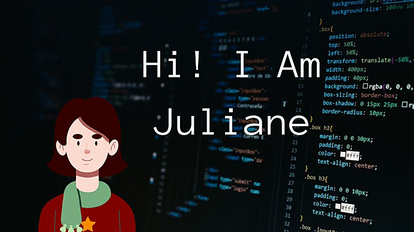

## Hi there 👋

My name is Juliane and I am a Software Engineer student, graduated from technical school and currently looking forward to improve my knowledge in web development. 

- 🔭 I’m currently working on a blog project
- 🌱 I’m currently learning Fullstack Web Development and Software Engineering
- 👯 I’m looking to collaborate with other content creators
- 🥅 2021 Goals: Improve my portifolio
- ⚡ Fun fact: I am learning to speak spanish

### Technologies I use:

       

### Github Stats:
  

### How to contact me:

 
